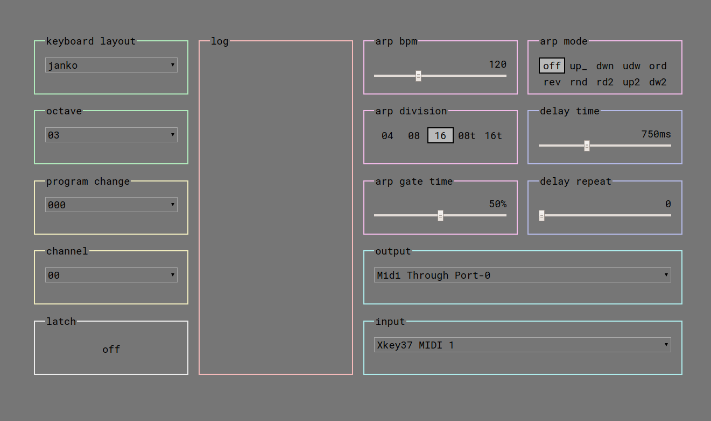

# Jank MIDI Keyboard
Turn your computer keyboard into a MIDI keyboard.

## Usage
* Open index.html in your browser (Google Chrome is the only [current] browser with WebMIDI)
* Select the MIDI output device (one is already selected by default).
* Select which note layout you'd like (one is already selected by default).
* Play with the arpeggiator and delay
* Type on your keyboard to trigger and release midi notes

## Keybindings
```
    letter/numbers         => MIDI note on/off
    ctrl-left/ctrl-right   => Octave down/up
    ctrl-down/ctrl-up      => keyboard layout down/up
    alt-left/alt-right     => Arpeggiator Mode left/right
    alt-down/alt-up        => Arpeggiator Gate decrease/increase
    shift-left/shift-right => Delay Repeat decrease/increase
    shift-down/shift-up    => Delay Time decrease/increase
    backspace/delete       => turn off all notes (if notes get stuck)
    escape                 => note off avalanche
```

## Screenshot


## TODO
* fix BPM input
* add latch functionality


